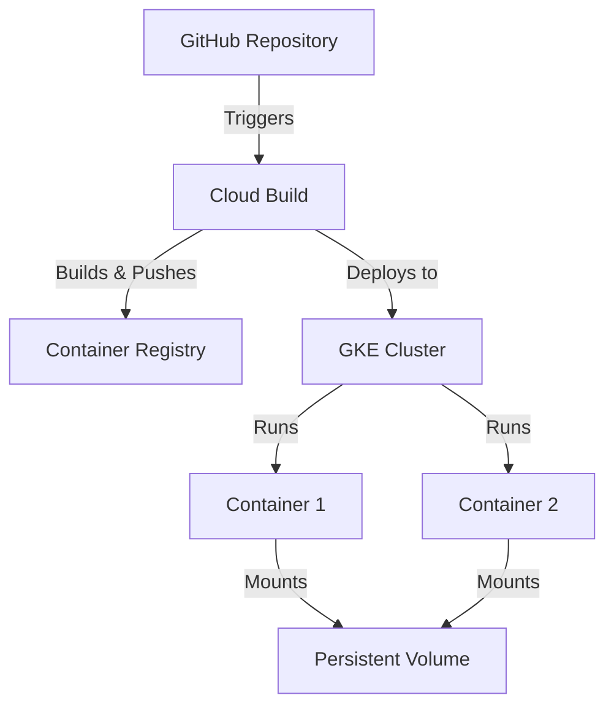

# 🚀 Kubernetes Microservices Assignment

A robust microservices architecture deployed on Google Kubernetes Engine (GKE) with automated CI/CD pipeline.

## 📋 Project Overview

This project demonstrates a production-ready Kubernetes deployment featuring:
- Multiple microservices with container orchestration
- Automated CI/CD pipeline using Cloud Build
- Persistent volume management
- Load balancer configuration
- Infrastructure as Code using Terraform

## 🏗️ Architecture



## 🛠️ Tech Stack

- **Infrastructure**: Google Cloud Platform (GCP)
- **Container Orchestration**: Kubernetes (GKE)
- **CI/CD**: Cloud Build
- **IaC**: Terraform
- **Runtime**: Node.js
- **Container Registry**: Artifact Registry

## 🚀 Getting Started

### Prerequisites

- Google Cloud SDK
- Terraform
- kubectl
- Node.js
- Docker

### Infrastructure Setup

1. Initialize Terraform:
   ```bash
   cd terraform
   terraform init
   terraform plan
   terraform apply
   ```

2. Configure kubectl:
   ```bash
   gcloud container clusters get-credentials k8s-assignment --zone us-central1-a
   ```

### Application Deployment

The project uses Cloud Build for automated deployments. Push to the main branch triggers:
- Container builds
- Image pushes to Artifact Registry
- Kubernetes manifest applications

## 🔧 Configuration Details

### GKE Cluster
- Region: us-central1-a
- Node Pool: 4 nodes (e2-small)
- Disk: 50GB pd-standard

### Kubernetes Resources
- Deployments with rolling updates
- LoadBalancer services
- Persistent Volume Claims
- Environment configurations

## 📝 CI/CD Pipeline

1. Code push triggers Cloud Build
2. Builds Docker images for microservices
3. Pushes to Artifact Registry
4. Updates Kubernetes deployments
5. Handles rolling updates

## 🔐 Security Considerations

- Custom service accounts with minimal permissions
- Private container registry
- Node pool OAuth scoping
- Network policy enforcement

## 📈 Monitoring & Scaling

- Built-in GKE monitoring
- Horizontal pod autoscaling
- Resource requests and limits
- Load balancer health checks

## 👥 Contributing

1. Fork the repository
2. Create a feature branch
3. Commit changes
4. Push to the branch
5. Open a Pull Request

## 📄 License

This project is licensed under the MIT License - see the LICENSE file for details.
